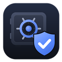
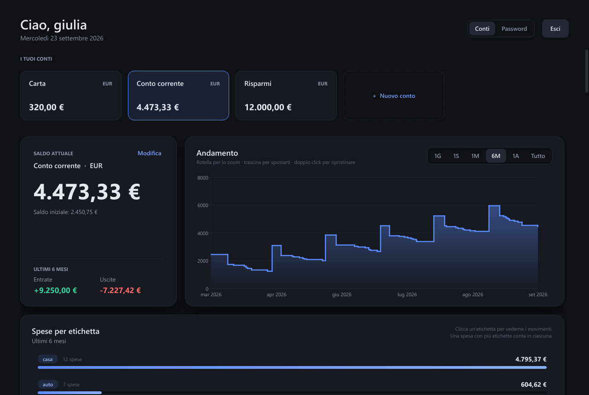
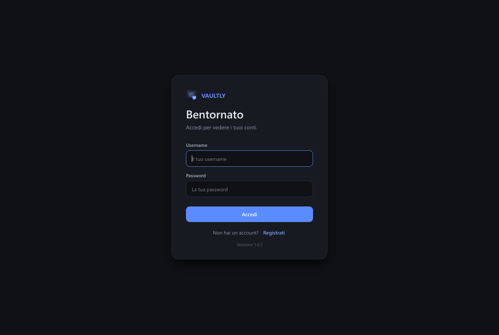
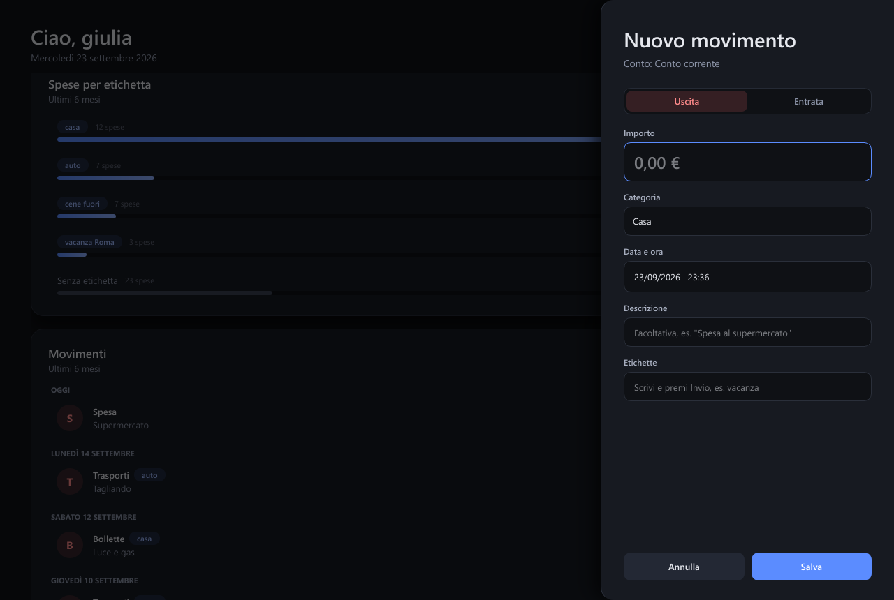
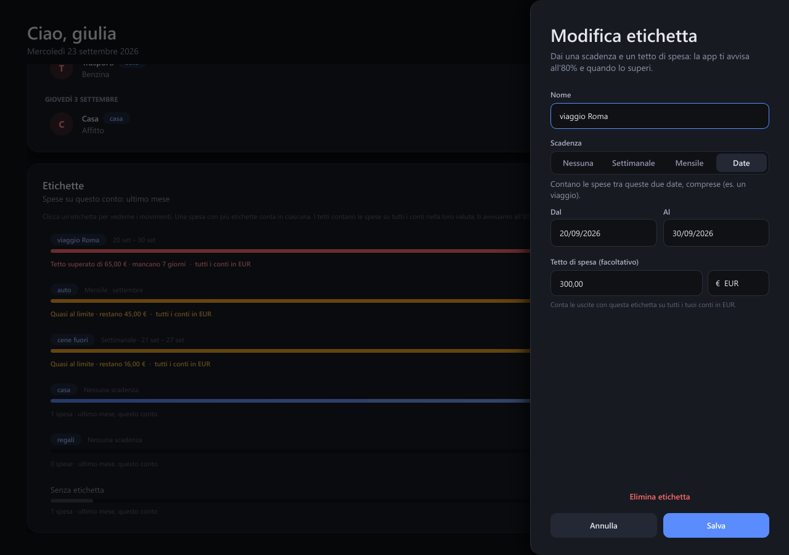
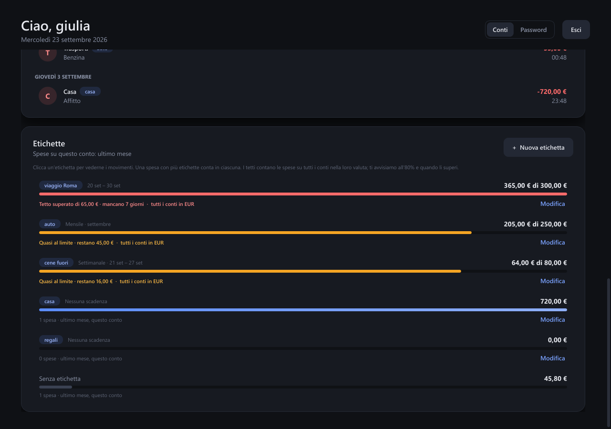
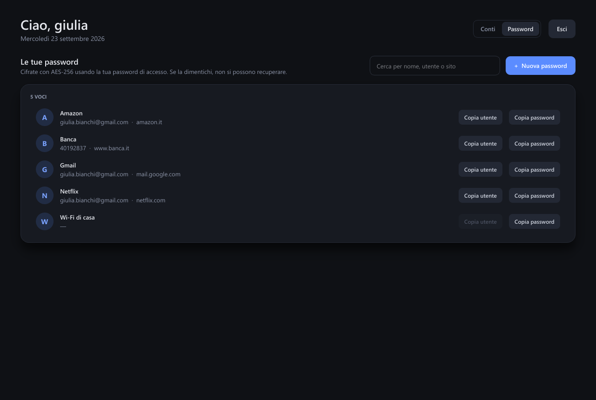

<p align="center">
  
</p>

<h1 align="center">Vaultly</h1>

<p align="center">
  Tieni sotto controllo i tuoi soldi e le tue password, in un'unica app per Windows.<br>
  <a href="https://github.com/4Kumiho/Vaultly/releases/latest"><b>⬇ Scarica l'ultima versione</b></a>
</p>



---

## Cosa fa Vaultly

- **Conti**: crea uno o più conti (conto corrente, carta, contanti, risparmi…), ognuno con la sua valuta: euro, dollaro, sterlina, franco svizzero o yen.
- **Entrate e uscite**: registra ogni movimento con importo, categoria (Casa, Spesa, Trasporti, Stipendio…), data e una descrizione.
- **Etichette e tetti di spesa**: crea etichette tue, come "viaggio Roma", "auto" o "regali", con una scadenza (settimanale, mensile o tra due date) e un tetto di spesa. Vaultly ti mostra quanto spendi per ciascuna e ti avvisa quando stai per superare il tetto.
- **Grafico del saldo**: guarda come cambia il tuo saldo nell'ultimo giorno, settimana, mese, 6 mesi, anno o da sempre, con zoom e spostamento col mouse.
- **Password**: conserva login e password dei tuoi account (email, banca, streaming…) in un'area **cifrata**, con un generatore di password sicure.
- **Più persone sullo stesso PC**: ognuno ha il suo utente, con username e password, e vede solo i propri dati.
- **Aggiornamenti automatici**: quando esce una nuova versione, Vaultly te lo dice e si aggiorna da solo.

Tutto resta **sul tuo computer**: nessun account online, nessun server, nessun abbonamento.

---

## Installazione

**Serve:** un PC con Windows 10 o Windows 11 (64 bit). Non servono permessi di amministratore.

1. Vai alla pagina **[Releases](https://github.com/4Kumiho/Vaultly/releases/latest)** e, in fondo alla sezione *Assets*, scarica **`Vaultly-Setup-x.y.z.exe`**, dove `x.y.z` è il numero di versione.
2. Apri il file scaricato.
3. **Se compare "Windows ha protetto il PC"** (una finestra blu): clicca **Ulteriori informazioni** e poi **Esegui comunque**.
   Windows mostra questo avviso per i programmi di sviluppatori indipendenti. Non significa che il file sia pericoloso.
4. Segui l'installazione: scegli se vuoi l'icona sul desktop e clicca **Installa**.
5. Alla fine Vaultly si apre da solo. Da quel momento lo trovi nel **menu Start**.

> Il file `appcast.xml` che vedi tra gli *Assets* serve solo agli aggiornamenti automatici: non devi scaricarlo.

---

## Primi passi

### 1. Crea il tuo utente



La prima volta clicca **Registrati**, scegli uno username e una password (almeno 6 caratteri) e ripetila per conferma.

> ⚠️ **Non dimenticare la password.** Protegge i tuoi dati e **non si può recuperare**: non esiste un "password dimenticata". Se la perdi, non potrai più entrare in Vaultly né leggere le password che hai salvato.

Le volte successive inserisci username e password e clicca **Accedi**.

### 2. Crea il tuo primo conto

Appena entri, Vaultly ti chiede di creare un conto:

- **Nome**: per esempio "Conto corrente";
- **Valuta**: euro o un'altra. Non si può cambiare in seguito;
- **Saldo iniziale**: quanto c'è sul conto adesso. Puoi correggerlo quando vuoi con **Modifica**.

Puoi aggiungere altri conti in qualsiasi momento con la scheda **+ Nuovo conto**. Clicca la scheda di un conto per vederne il saldo e i movimenti.

### 3. Registra entrate e uscite



Clicca **+ Aggiungi movimento** e compila il pannello:

1. scegli **Uscita** o **Entrata**;
2. scrivi l'**importo** (vanno bene sia `12,50` sia `12.50`);
3. scegli la **categoria**;
4. se serve, cambia **data e ora**: puoi inserire anche movimenti passati;
5. aggiungi una **descrizione** e le **etichette**, se vuoi;
6. clicca **Salva**.

Il saldo si aggiorna subito. Per **modificare o eliminare** un movimento, cliccalo nella lista. Per eliminare devi cliccare **due volte** su "Elimina movimento", per evitare errori.

### 4. Etichette, scadenze e tetti di spesa

Le etichette ti dicono **quanto spendi per qualcosa**, per esempio un viaggio, l'auto o le cene fuori, e ti avvisano se stai spendendo troppo.

**Mettere un'etichetta su una spesa.** Nel pannello del movimento, nel campo **Etichette**, scrivi un nome, per esempio `viaggio Roma`, e premi **Invio**. Puoi metterne più d'una sulla stessa spesa, e Vaultly ti suggerisce quelle che hai già. Se l'etichetta non esiste ancora viene creata; per toglierla da una spesa clicca la **×**.

**Creare un'etichetta con scadenza e tetto.** In fondo alla dashboard, sotto i movimenti, c'è il riquadro **Etichette**. Clicca **+ Nuova etichetta**, oppure **Modifica** accanto a un'etichetta che hai già:



- **Scadenza**: il periodo in cui contare la spesa:
  - **Nessuna**: da sempre;
  - **Settimanale**: la settimana in corso, e il conteggio riparte ogni lunedì;
  - **Mensile**: il mese in corso, e riparte il primo del mese;
  - **Date**: dal giorno al giorno che scegli tu, per esempio un viaggio dal 20 al 30 settembre.
- **Tetto di spesa** (facoltativo): quanto vuoi spendere al massimo in quel periodo, per esempio 300 €. Si può superare, ma Vaultly ti avvisa. Il tetto conta le spese con quell'etichetta su **tutti i tuoi conti** nella stessa valuta.

**Il riquadro Etichette:**



- Per le etichette con tetto vedi **quanto hai speso su quanto puoi spendere**. La barra è verde finché va tutto bene, **gialla quando arrivi all'80%**, **rossa quando superi il tetto**, e sotto trovi quanto ti resta o di quanto l'hai superato.
- Per le etichette senza tetto vedi quanto hai speso sul conto e nel periodo che stai guardando.
- **Clicca un'etichetta** per vedere nella lista solo i suoi movimenti; per tornare a vedere tutto clicca **Mostra tutti**.
- Una spesa con più etichette conta in ognuna.

**Gli avvisi.** Quando salvi una spesa che porta un'etichetta all'80% o oltre il tetto, in basso compare un messaggio giallo o rosso. Lo stesso avviso compare quando accedi, se hai tetti superati o quasi.

**Eliminare un'etichetta.** Da **Modifica** → **Elimina etichetta**. Viene tolta dalle spese, ma le spese restano.

### 5. Leggi il grafico

In alto a destra scegli il periodo: **1G** (un giorno), **1S** (una settimana), **1M**, **6M**, **1A** o **Tutto**. Il periodo vale anche per la lista dei movimenti, per i totali di entrate e uscite e per le etichette senza tetto. Quelle con tetto seguono la loro scadenza.

Sul grafico:

- **rotellina del mouse**: zoom avanti e indietro;
- **clic e trascina**: ti sposti nel tempo;
- **doppio clic**: torni al periodo scelto;
- **passando col mouse** vedi il saldo in quel momento.

### 6. Conserva le tue password



In alto clicca **Password** (accanto a "Conti").

- **+ Nuova password**: inserisci nome (es. "Gmail"), sito, username e password. Con **Genera** Vaultly crea una password sicura, e con **Mostra** la vedi in chiaro.
- **Copia utente** / **Copia password**: copiano negli appunti. Dopo **30 secondi** gli appunti si svuotano da soli, e Vaultly chiede a Windows di non salvare il contenuto nella cronologia degli appunti (Win+V).
- Usa la **ricerca** per trovare subito una voce.
- Clicca una voce per modificarla o eliminarla.

Quando hai finito clicca **Esci**: Vaultly torna alla schermata di accesso.

---

## Aggiornamenti

Vaultly controlla da solo se c'è una nuova versione, all'avvio e poi una volta al giorno. Quando la trova ti mostra le novità e puoi scegliere **Aggiorna ora**, **Più tardi** o **Salta questa versione**.

Se scegli di aggiornare, Vaultly:

1. scarica l'aggiornamento;
2. ne **verifica la firma digitale**: se il file non è quello originale, viene scartato;
3. si chiude, si installa e si riapre da solo.

**I tuoi dati restano dove sono.** Puoi anche controllare a mano con **Cerca aggiornamenti**, in fondo alla schermata di accesso.

---

## I tuoi dati e la sicurezza

- **Solo sul tuo PC.** Conti, movimenti e password sono salvati sul tuo computer, nella cartella `%APPDATA%\Vaultly`. Vaultly non li invia a nessuno: l'unica cosa che scarica da Internet sono gli aggiornamenti.
- **Ogni installazione parte da zero.** Su un altro computer, o su un altro account di Windows, Vaultly è vuoto e non può vedere i tuoi dati.
- **Password di accesso protetta.** Non viene salvata: Vaultly ne conserva solo un'"impronta" irreversibile (PBKDF2).
- **Area password cifrata.** Le voci sono cifrate con AES-256 usando la tua password di accesso. Senza di essa sono illeggibili, anche aprendo direttamente il file dei dati.
- **Più persone sullo stesso account di Windows.** Ognuno entra con il suo utente e dentro Vaultly vede solo i suoi dati. Le **password salvate** restano cifrate per ciascuno. **Conti e movimenti**, invece, nel file dei dati non sono cifrati. Se vuoi la massima riservatezza, usa un account di Windows per persona.

---

## Disinstallazione

Apri **Impostazioni di Windows → App → App installate** (su Windows 10: **App e funzionalità**), cerca **Vaultly** e scegli **Disinstalla**.

> ⚠️ La disinstallazione **cancella tutto**: il programma **e tutti i dati** (utenti, conti, movimenti e password salvate). Non rimane nulla sul computer. Se reinstalli Vaultly, riparte da zero.

---

## Domande frequenti

**Ho dimenticato la password. Posso recuperarla?**
No. È il prezzo della sicurezza: la password non viene salvata da nessuna parte, e senza di essa nessuno, nemmeno lo sviluppatore, può aprire il tuo utente o leggere le password che hai salvato. Puoi creare un nuovo utente, ma i dati di quello vecchio restano inaccessibili.

**Posso usare Vaultly su due computer con gli stessi dati?**
No, ogni computer ha i suoi dati e non c'è sincronizzazione.

**Posso cambiare la valuta di un conto?**
La valuta si sceglie quando crei il conto e non si cambia più, perché i movimenti sono già in quella valuta. Puoi creare un nuovo conto con un'altra valuta.

**Windows dice che il programma "potrebbe danneggiare il PC".**
È l'avviso standard per i programmi che non hanno un certificato a pagamento. Clicca **Ulteriori informazioni → Esegui comunque**. Il file ufficiale si scarica solo dalla pagina [Releases](https://github.com/4Kumiho/Vaultly/releases/latest) di questo progetto.

**Vaultly funziona su Mac o Linux?**
Per ora solo su Windows.

---

## Per sviluppatori

Vaultly è scritto in C++17 con Qt 6 (Widgets, SQL, Charts), usa SQLite come database e CMake + Ninja come build.

```powershell
# Requisiti: Qt 6.10 (MinGW 64 bit, con il modulo Qt Charts), CMake, Ninja
cmake -S . -B build -G Ninja -DCMAKE_BUILD_TYPE=Debug -DCMAKE_PREFIX_PATH=C:\Qt\6.10.3\mingw_64
cmake --build build
ctest --test-dir build --output-on-failure
.\build\Vaultly.exe
```

Nelle build di sviluppo gli aggiornamenti automatici sono disattivati. Le release si preparano con `scripts\release.ps1`, che richiede Inno Setup e la chiave di firma, disponibile solo al manutentore.

Librerie di terze parti incluse: [Monocypher](https://monocypher.org) (licenza BSD-2 / CC0), in `external/monocypher`.
